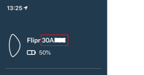

# Documentation Plugin Jeedom Flipr
Le plugin Flipr pour Jeedom vous permet de récupérer les mesures réalisées par votre Flipr.

## Prérequis
Pour utiliser ce plugin il faut bien sûr disposer d'un Flipr mais il faut aussi que vous puissiez accéder aux relevés à distance.
Au moment de la rédaction de ce guide, la version Flipr Start sans abonnement ne permet pas l'utilisation du plugin, les autres devraient fonctionner.

## Configuration
Pour configurer le plugin il vous faudra :
- l'identifiant du Flipr
- l'identifiant de votre compte goflipr.com
- le mot de passe de votre compte goflipr.com

Pour l'identifiant du Flipr, vous pouvez le trouver dans le menu de l'application en haut à gauche :

## Installation
Une fois le plugin installé depuis le market, rendez-vous sur la page de configuration du plugin via le menu **Plugins**, **Gestion des plugins** puis en cliquant sur l'icône du plugin.

Dans le bloc **Etat** cliquez sur **Activer**.

Une fois le plugin activé, un bloc **Configuration** apparaît. Renseignez dans ce bloc les identifiant et mot de passe de votre compte goflipr.com puis cliquez sur **Sauvegarder**.

Une fois la sauvegarde effectuée, rendez-vous dans le plugin via **Plugins**, **Objets Connectés** puis **Flipr**. Cliquez sur l'icône **+** pour ajouter votre Flipr.

Définissez le nom que vous voulez donner à votre Flipr, choisissez à quel objet Jeedom vous souhaitez le rattacher et rendez le **Actif** et **Visible**. Enfin, renseignez l'id de votre Flipr trouvé plus haut dans **Paramètres** puis ciquez sur **Sauvegarder**. 

Voter objet est prêt !

## Utilisation
Lors de la sauvegarde de l'objet Flipr, une première lecture de ces infos doit avoir lieu. Ensuite les relevés sont effectués toutes les heures.

Le plugin n'inclut pas de widget spécifique, toutes les valeurs relevées ne sont pas affichées et/ou historisées par défaut, vous pouvez utilisez le panneau **Commandes** de l'objet Flipr pour modifier les réglages.

Les valeurs relevées sont les suivantes (les exemples sont des valeurs observées chez moi):

| Nom | Description | Infos complémentaires, exemple de valeurs |
| ----------- | ----------- | ----------- |
| Conductivité | Niveau de conductivité de l'eau | Pour les piscines au sel *(medium, high, low)* |
| Désinfectant Déviation | Tendance de l'évolution du traitement | Par rapport à la valeur idéale[^1] *(-0,1)* |
| Désinfectant Niveau | Niveau de désinfectant du bassin | Ce qui s'affiche dans l'appli *(Bon, Parfait, ...)* |
| Désinfectant Niveau Déviation | Niveau de la tendance d'évolution du traitement | Non utilisé selon la doc de l'API *(medium, high, low)* |
| Evolution batterie | Niveau de la batterie | Valeur pas très précise il me semble, passé de 1 à 0.5 chez moi... *(1, 0.5)* |
| Index UV | Valeur UV mesurée | Index UV mesuré au niveau du Flipr *(0, 7, ...)* |
| PH Niveau | Niveau du PH dans le bassin | Ce qui s'affiche dans l'appli *(Bon, Parfait, ...)* |
| PH Niveau Déviation | Niveau de la tendance d'évolution du PH | Non utilisé selon la doc de l'API *(medium, high, mediumlow)* |
| PH Déviation | Tendance d'évolution du PH | Par rapport à la valeur idéale [calcul][1] *(-0,71)* |
| PH Valeur | Valeur du PH | Lecture du PH par la sonde *(7.10, 6.92, ...)* |
| Potentiel Redox | Valeur du Redox | Lecture de la sonde ORP *(572 mV, 730 mV, ...)* |
| Température | Température | Température du bassin en °C *(14.25 °C, 28.10 °C, ...)* |

>[^1]:Déviation en % (1 = 100%) par rapport à la valeur de référence (valeur idéale).
>1,0 étant la valeur max, et -1 la valeur min, au delà desquelles on considère qu’il y a un problème.